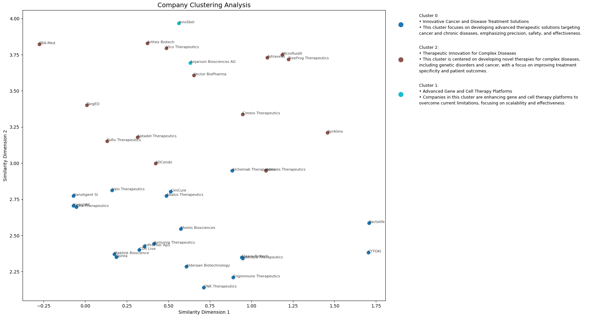

# Company Clusterer

A Python-based tool for analyzing and clustering companies based on their business descriptions using natural language processing and machine learning techniques.

## Overview

This project analyzes companies by:
1. Processing company descriptions and metadata
2. Creating semantic embeddings of company information
3. Clustering similar companies together
4. Generating cluster descriptions using GPT-4
5. Visualizing the results in an interactive plot

## Features

- Semantic text analysis using SentenceTransformer
- K-means clustering of company embeddings
- GPT-4 powered cluster description generation
- Interactive visualization with company clustering
- Support for custom data input via JSON

## Installation

1. Clone the repository
2. Create a virtual environment
3. Install the dependencies
4. Create a `.env` file with the following variables:
    - `OPENAI_API_KEY`: Your OpenAI API key
5. Run the script

Example Output:

